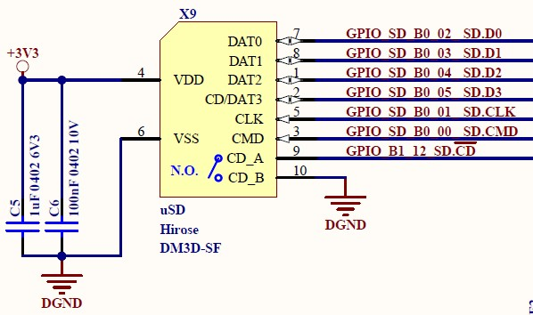
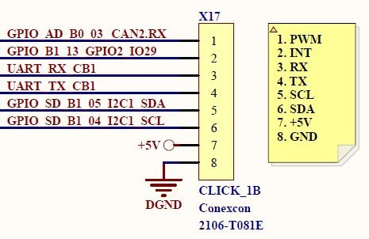
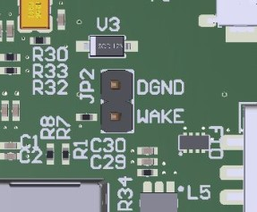
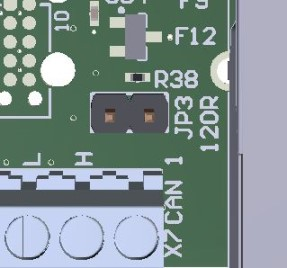

Table of Contents
=================

* [Functional Description](#functional-description)
  * [Overview](#overview)
  * [List of compatible modules](#list-of-compatible-modules)
  * [Top Connectors](#top-connectors)
    * [X1 USB-C](#x1-usb-c)
    * [X2 USB A](#x2-usb-a)
    * [X3 JTAG](#x3-jtag)
    * [X4 Camera](#x4-camera)
    * [X5 Micro USB Open SDA debug](#x5-micro-usb-open-sda-debug)
    * [X6 Ethernet](#x6-ethernet)
    * [X7 CAN](#x7-can)
    * [X8 Micro SIM socket](#x8-micro-sim-socket)
    * [X9 Micro SD](#x9-micro-sd)
    * [X10 Connector header 2x5](#x10-connector-header-2x5)
    * [X11	M.2 KEY B](#x11-m.2-key-b)
    * [X12 40 pos expansion receptacle](#x12-40-pos-expansion-receptacle)
    * [X13 Battery holder](#x13-battery-holder)
    * [X16 X17 Click interface 1](#x16-x17-click-interface-1)
    * [X18 X19 Click interface 2](#x18-x19-click-interface-2)
    * [X20 Connector header 1x5](#x20-connector-header-1x5)
  * [Bottom Connectors](#bottom-connectors)
    * [X14 FPC/FFC Display](#x14-fpc-ffc-display)
    * [X15 FPC/FFC Touch](#x15-fpc-ffc-touch)
  * [Configurable Connectors](#configurable-connectors)
    * [JP1](#jp1)
    * [JP2](#jp2)
    * [JP3](#jp3)
    * [JP4](#jp4)
    * [JP6](#jp6)
    * [JP7](#jp7)
  * [Push buttons](#push-buttons)
  * [Debug options](#debug-options)
* [Electrical Specifications](#electrical-specifications)
* [Mechanical Specifications](#mechanical-specifications)

# Functional Description

## Overview
The CARRIER-SIMPLIA-01 is a dev board used along wit M.2 modules.

This carrier has standard connectors and pins in oder to use the modules peripherals. Not all signals from the modules have to use the functionality described in this document, some signals are also present in headers to help accesing them in custom configurations.

## List of compatible modules

This carrier can be used with the following references:
- [M.2 COMPACT 1052](https://github.com/simpliaelectronics/compact-hw/tree/main/M.2/imxrt1052)
- [M.2 CONNECT IMXRT 1052 Wifi/BT](https://github.com/simpliaelectronics/connect-hw/tree/main/M.2/imxrt1052_Wifi_BT)
- [CONNECT IMXRT 1052 LTE-M/Nb-IoT/GNSS](https://github.com/simpliaelectronics/connect-hw/tree/main/M.2/imxrt1052_modem_gnss)

## Top Connectors

### X1 USB-C

This connector implements a USB2.0 including cable orientation detection as described in [AN1953](https://ww1.microchip.com/downloads/en/appnotes/00001953a.pdf).

When present, the 5V VBUS power comming from the cable can be used to power the board. Refer to [Electrical Specifications](#electrical-specifications) for more information regarding power.

USB devices can be implemented using this interface. For USB host functionality refer to [X2 USB A](#x2-usb-a) connector.

### X2 USB A

This connector implements a USB 2.0 A Host including delivering 5V to the device. Refer to [Electrical Specifications](#electrical-specifications) for more information regarding power.

### X3 JTAG

This connector has the footprint to use [Segger 10-Pin Needle Adapter](https://www.segger.com/products/debug-probes/j-link/accessories/adapters/10-pin-needle-adapter/)

This cable can be connected to any 10 pin JTAG probe with SWD interface. Ony SWD and nRST signals are implemented. This interface shares debug signals with the on board Open SDA interface.

### X4 Camera

24 position FFC/FPC for camera module such as [OV7725 camera sensor](https://es.aliexpress.com/item/4000130399573.html?spm=a2g0s.9042311.0.0.274263c0fw0Tj3).

When checking the schematics take into account that the pinout is reversed because the connector has bottom connection.

### X5 Micro USB Open SDA debug

This micro USB connector is used to provide debug functionality for the inserted modules. The protocol used is Open SDA using a MK20 microcontroller from NXP.

### X6 Ethernet

Sandard Ethernet connector with integrated magnetics and LEDs. Only 10/100 pairs are connected.

### X7 CAN

Terminal block with CAN H/L signals, GND and 5V. CAN bus is not isolated.

THe board has a 120ohm termination resistor that can be enabled using [JP3](#jp3).

### X8 Micro SIM socket

Standard Micro SIM socket with push pull insertion. Includes ESD protection. Only [CONNECT IMXRT 1052 LTE-M/Nb-IoT/GNSS](https://github.com/simpliaelectronics/connect-hw/tree/main/M.2/imxrt1052_modem_gnss) makes use of this interface.

### X9 Micro SD

Standard Micro SD connector with push pull insertion. Includes ESD protection. Only [M.2 COMPACT 1052](https://github.com/simpliaelectronics/compact-hw/tree/main/M.2/imxrt1052) and [CONNECT IMXRT 1052 LTE-M/Nb-IoT/GNSS](https://github.com/simpliaelectronics/connect-hw/tree/main/M.2/imxrt1052_modem_gnss).

[M.2 CONNECT IMXRT 1052 Wifi/BT](https://github.com/simpliaelectronics/connect-hw/tree/main/M.2/imxrt1052_Wifi_BT) uses SDIO interface internally to connect to WIFI module.

### X10 Connector header 2x5

Connector header that exposes the SDIO signals, GND, 3V3 and 5V. This way this interface can be used to connect external boards over SIO/SPI or nay other interface that can be muxed into those pins.

VCC_SDIO power supply is not present in this connector.

### X11	M.2 KEY B

M.2 connector for SIMPLIA module.

### X12 40 pos expansion receptacle

Expansion connector for SIMPLIA module.

### X13 Battery holder

Battery holder for 3V 10mm coin cells (CR1025).

### X16 X17 Click interface 1

Click connector as described in the [Mikroe specification](https://www.mikroe.com/click/interface). Signals connected here can be multiplexed in the procesor to be able to drive the boards.

The serial port present in X17 can be routed to the debug interface instead of the click connector using [JP6](#JP6) and [JP7](#JP7).

### X18 X19 Click interface 2

Click connector as described in the [Mikroe specification](https://www.mikroe.com/click/interface). Signals connected here can be multiplexed in the procesor to be able to drive the boards.

### X20 Connector header 1x5

Connector header that exposes CAN2 TX/RX signals, GND, 3V3 and 5V. These signals are also present in the click boards (PWM in X17 and INT in X19).

## Bottom Connectors

### X14 FPC/FFC Display

Connector compatible with displays:
- POWERTIPSPF_PH800480T033_ICC01

The backlight current can be controlled using a PWD from the module.

### X15 FPC/FFC Touch

Connector compatible with touch from displays:
- POWERTIPSPF_PH800480T033_ICC01

## Configurable Connectors

Connector headers that can be configured using a 2,54mm(0.100") jumper.

### JP1

| Configuration | Description                  |
|---------------|------------------------------|
|  Open         | Boot from internal flash     |
|  Closed       | Boot SD card in X9 connector |

### JP2

| Configuration | Description     |
|---------------|-----------------|
|  Open         | WAKE deasserted |
|  Closed       | WAKE asserted   |

### JP3

| Configuration | Description                            |
|---------------|----------------------------------------|
|  Open         | 120 ohm terminal resistor disconnected |
|  Closed       | 120 ohm terminal resistor connected    |

### JP4

| Configuration | Description          |
|---------------|----------------------|
|  Open         | Normal flash boot    |
|  Closed       | Encrypted flash boot |

### JP6

| Configuration | Description                          |
|---------------|--------------------------------------|
|  1-2          | UART TX connected to click interface |
|  2-3          | UART TX connected to Open SDA        |

### JP7

| Configuration | Description                          |
|---------------|--------------------------------------|
|  1-2          | UART RX connected to click interface |
|  2-3          | UART RX connected to Open SDA        |

## Push buttons

| Button | Description        |
|--------|--------------------|
|  S1    | Reset the board    |
|  S2    | Assert WAKE signal |

## Debug options

The board has an Open SDA interface using a MK20 microcntroller.

This interface has a OpenSDA V2 Firmware from SEGGER. Follow this [installation instructions](https://www.segger.com/products/debug-probes/j-link/models/other-j-links/opensda-sda-v2/) to be able to use this interface.

The serial port used as a console can be routed to the debug interface instead of the click connector using [JP6](#JP6) and [JP7](#JP7).

# Electrical Specifications

The board can be powered from [X1 USB-C](#x1-usb-c) or [X5 Micro USB Open SDA debug](#x5-micro-usb-open-sda-debug). Both cables can be used at the same time.

The power delivered to the board will depend on the cable used:

| Cable         | Description                                              |
|---------------|----------------------------------------------------------|
|  X1 USB C     | 1.5/3A dependng on the adapter and/or computer interface |
|  X5 Micro USB | 0.5/1A dependng on the adapter and/or computer interface |

Powering from the 5V present in the connectors is possible but not recomended if a USB cable s connected to X1 or X5.

Do not power the board from the 3V3 singals present in the connectors.

# Mechanical Specifications

TBD
