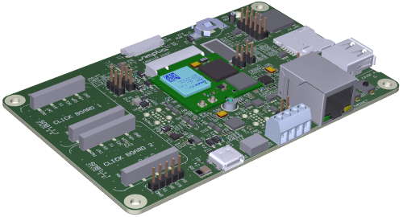

Table of Contents
=================

* [Table of Contents](#table-of-contents)
* [M.2 Dev Kits info](#m2-dev-kits-info)
* [Carriers](#carriers)
   * [CARRIER-SIMPLIA-01](#carrier-simplia-01)
* [Dev Kits](#dev-kits)
   * [KIT-SIMPLIA-01](#kit-simplia-01)

# M.2 Dev Kits info
Information regarding different Carrier boards and kits available from SIMPLIA.

# Carriers

## CARRIER-SIMPLIA-01
This carrier uses M.2 modules and exposes the pinout of the module to standard
connectors. The board also includes two MikroBUS interfaces.

# Dev Kits

## KIT-SIMPLIA-01
This kit is compossed of a CARRIER-SIMPLIA-01 and different M.2 modules and
accesories.
